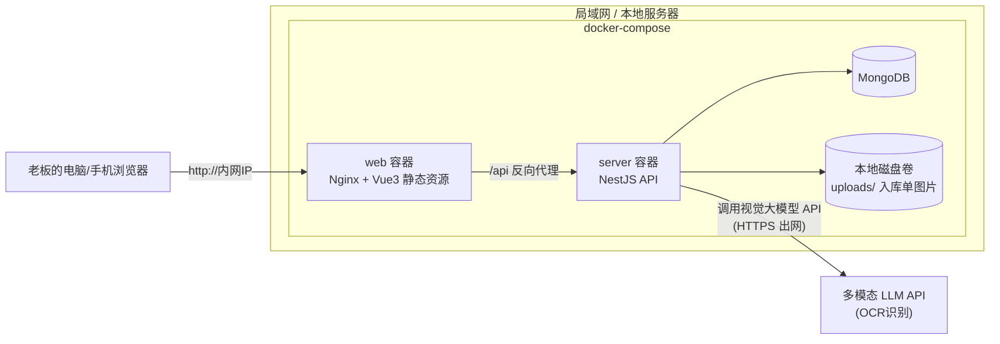

# 玩具加工管理系统 —— 架构设计 v1

技术选型（已与用户确认）：

| 决策项 | 选择 |
|---|---|
| 后端 | Node.js + NestJS + TypeScript |
| 数据库 | MongoDB |
| OCR 方案 | 多模态大模型 API（Claude / GPT-4V / 通义千问VL 等，抽象成可插拔 Provider） |
| 部署 | 本地 / 局域网部署（Docker Compose） |
| 前端 | Vue3 + TypeScript + Element Plus + Vite（参考 Soybean Admin 布局，不引入其后端/权限系统） |

---

## 一、整体架构图



局域网内没有公网入口，仅 `server → LLM API` 这一路需要访问外网（HTTPS 出站即可，不需要开放入站端口）。

---

## 二、代码仓库结构（pnpm workspace 单体仓库）

```
kingbear/
├── apps/
│   ├── web/                 # Vue3 + Element Plus 前端
│   └── server/               # NestJS 后端
├── packages/
│   └── shared/                # 前后端共享的 TS 类型（入库表单结构、OCR结果结构等）
├── docs/
│   ├── requirements-v1.md
│   └── architecture.md
├── docker-compose.yml
├── .env.example
└── pnpm-workspace.yaml
```

理由：单用户单团队小项目，monorepo + pnpm workspace 比拆多仓省心；`shared` 包让入库单/OCR结果这种前后端都要用的复杂结构只定义一次，避免字段对不齐。

---

## 三、后端模块（NestJS）

```
apps/server/src/
├── auth/          # 单用户登录（用户名+密码 → JWT），无角色/权限概念
├── factory/       # 玩具厂管理 CRUD
├── product/       # 产品管理 CRUD（属于某玩具厂）
├── inbound/       # 入库管理（核心模块）
├── ocr/           # OCR Provider 封装（可插拔）
├── billing/       # 应收账单（实时聚合查询，不落库账单实体）
├── dashboard/     # 首页统计聚合
└── upload/        # 图片存储（本地磁盘）
```

### 为什么这样划分
- `ocr` 独立出来是因为它是唯一对外部（LLM API）的依赖，未来换供应商/换 prompt 只改这一个模块。
- `billing` 没有自己的持久化实体（除了收款状态），因为需求明确"实时计算，不生成固定账单"——账单页面本质是对 `inboundRecords` 做聚合查询，这样"入库改了 → 账单自动同步"是**天然成立**的，不需要额外写同步逻辑，减少一类 bug。

---

## 四、数据模型（MongoDB 集合）

### `users`
单用户，但仍建集合便于以后扩展。
```
{ _id, username, passwordHash, createdAt }
```

### `factories`（玩具厂）
```
{ _id, name, contact, phone, address, remark, createdAt, updatedAt }
```

### `products`（产品，属于玩具厂）
```
{ _id, factoryId, sku, name, factoryPrice, processPrice, remark, createdAt, updatedAt }
```
唯一索引 `(factoryId, sku)`。

### `inboundRecords`（入库单，核心实体）
```ts
{
  _id,
  code: "RK20260821001",        // 系统生成入库单号
  factoryId: ObjectId | null,    // OCR 未匹配到时为 null
  needFactorySelect: boolean,     // 玩具厂识别失败，需人工选
  inboundDate: Date,               // 识别失败则默认当天
  imageUrl: string,
  ocrRawResult: object,             // 大模型原始返回，留痕/排障用
  status: "processing" | "pending_confirm" | "completed",
  items: [
    {
      productId: ObjectId | null,   // 货号未匹配到已有产品时为 null，可现场建产品
      sku: string,
      name: string,
      weightJin: number,             // 重量(斤)
      unitWeightG: number,           // 单个克重(g)
      qtyDeclared: number | null,     // 单据上写的数量（如果有）
      qtyCalculated: number,          // 系统按公式算出的数量
      qtyFinal: number,                // 最终采用值
      quantitySource: "declared" | "calculated",
      hasQuantityDiff: boolean,
      factoryPrice: number,
      amount: number,                  // qtyFinal * factoryPrice
      remark: string
    }
  ],
  createdAt, updatedAt
}
```

### `monthlyBillStatus`（收款状态标记）
账单本身不落库，**只有"是否已收款"这个人工标记**需要持久化，按 玩具厂+年月 维度存一条：
```
{ _id, factoryId, yearMonth: "2026-08", status: "unpaid" | "paid", updatedAt }
```

---

## 五、关键业务流程

### 1. 入库 OCR 识别流程
```
① FE 上传图片
   → POST /inbound/upload (multipart)

② BE 存文件到本地磁盘 uploads/inbound/2026/08/{uuid}.jpg
   → 创建 InboundRecord(status=processing)

③ BE 调用 OcrModule
   → 组装 prompt，要求大模型按固定 JSON Schema 返回：
     { factoryName, date, items: [{sku, name, weightJin, unitWeightG, qtyDeclared}] }

④ 后处理：
   - 玩具厂名称 → 模糊匹配 factories，匹配失败 → needFactorySelect=true
   - 日期解析失败 → 默认当天
   - 每个产品行：qtyCalculated = weightJin × 500 ÷ unitWeightG
     若 qtyDeclared 存在且 ≠ qtyCalculated → hasQuantityDiff=true（差异写入 remark）
     若 qtyDeclared 不存在 → 直接采用 qtyCalculated

⑤ status → pending_confirm，返回前端展示

⑥ 人工确认页面：
   - 选玩具厂（若未匹配）
   - 每行选数量来源（单据数量 / 系统计算数量）
   - 货号未匹配到已有产品 → 可现场创建产品
   - 提交 → POST /inbound/:id/confirm
     → 重算 amount = qtyFinal × factoryPrice
     → status → completed
```

### 2. 修改 / 删除
- **修改**：直接改 `inboundRecords` 文档，重算 `amount`。账单页面下次查询时自动反映最新值 —— **不需要"同步账单"的额外代码**，这是聚合查询模型的自然结果。
- **删除**：前端二次确认弹窗，确认后硬删除记录（需求未要求保留历史）。

### 3. 应收账单查询
```
GET /billing?factoryId=xxx&yearMonth=2026-08

聚合 inboundRecords where factoryId=xxx AND inboundDate in [该月范围] AND status=completed:
  - 入库次数 = 匹配到的 InboundRecord 数
  - 加工数量 = Σ items.qtyFinal
  - 加工金额 = Σ items.amount
  - 明细 = 展开所有 items（日期/货号/名称/数量/工厂价/金额）
  - 收款状态 = 查 monthlyBillStatus(factoryId, yearMonth)，默认 unpaid
```

### 4. Dashboard 统计
- 今日/本月数据：对 `inboundRecords`（status=completed）按日期范围做聚合
- 玩具厂排行：本月按 factoryId 分组求 Σamount，降序
- 待处理提醒：
  - 待确认入库 = count(status=pending_confirm)
  - 数量异常 = count(items.hasQuantityDiff=true 且未处理)
  - 未收款账单 = count(monthlyBillStatus.status=unpaid)

---

## 六、前端结构（Vue3 + Element Plus）

```
apps/web/src/
├── layouts/BasicLayout.vue     # 左侧菜单 + 顶部Header + Tab页签（自研，非引入soybean代码）
├── views/
│   ├── dashboard/
│   ├── factory/
│   ├── product/
│   ├── inbound/                  # 重点页面
│   │   ├── UploadPanel.vue        # 左侧：上传区
│   │   ├── OcrResultForm.vue       # 右侧：OCR结果编辑表单
│   │   └── InboundList.vue          # 列表/搜索/修改/删除
│   └── billing/
├── api/                          # axios 封装 + 各模块请求
├── store/                        # pinia: user / tabs / app
└── types/                         # 从 packages/shared 复用
```

入库页面状态机（贯穿 UI）：`识别中 → 待确认 → 已完成`，对应 `inboundRecords.status`。

---

## 七、认证

单用户，无角色/权限系统。固定账号+密码登录（`users` 集合存 bcrypt hash），签发 JWT，前端路由守卫拦截未登录访问。局域网部署也做这层，防止内网其他人误操作/查看数据。

---

## 八、部署

`docker-compose.yml` 三个服务：
- `mongo`：官方镜像，数据卷持久化
- `server`：NestJS 编译后跑 Node，环境变量注入 `MONGO_URI`、`LLM_API_KEY` 等（`.env`，不入库）
- `web`：Nginx 提供构建后的静态资源，反代 `/api` 到 `server`

图片目录 `uploads/` 挂载宿主机目录，需要定期备份（连同 Mongo dump）。局域网内其他电脑通过 `http://<内网IP>:端口` 访问，无需公网/域名/证书。

---

## 九、暂缓/明确不做（与需求文档一致）

- 多角色、权限管理
- 收款金额/日期/方式明细
- 固定账单实体（账单永远是实时聚合结果）
- 加工价参与利润计算

---

## 十、待实现前的开放问题

1. ~~具体选用哪个多模态模型~~ —— 已定：**通义千问 VL**（阿里云 DashScope，OpenAI 兼容模式端点），实现见 `apps/server/src/ocr/providers/qwen-vl-ocr.provider.ts`，`OCR_PROVIDER=qwen-vl` 开启。
2. **入库单号编码规则**细节（如 `RK+日期+序号` 是否需要按玩具厂分段），留到实现入库模块时定。
